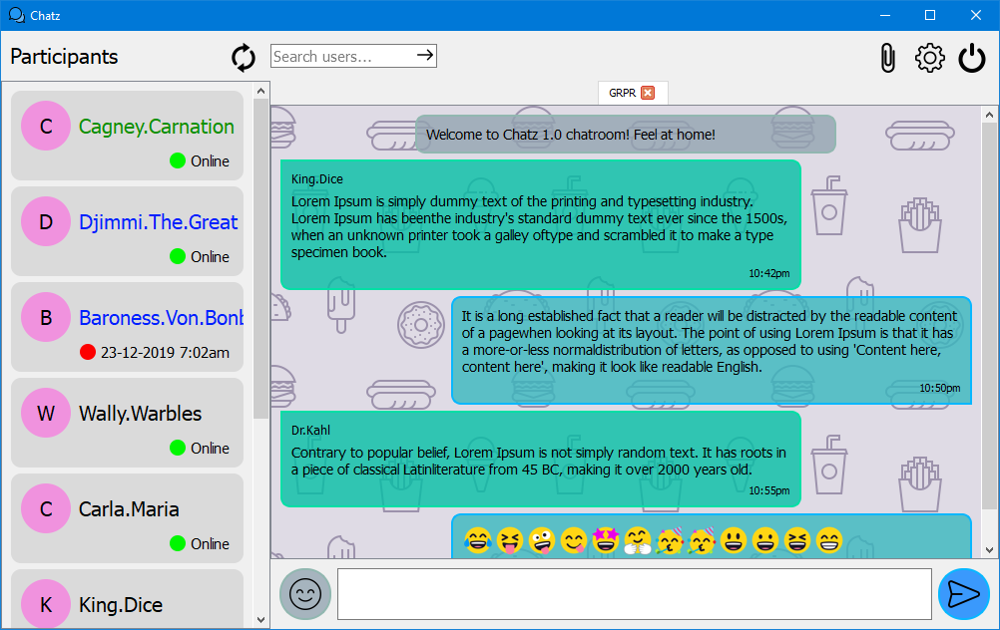

# Chatz-UI
A simple, python, PyQt4 chat user interface with emoji support

#### Dependencies
1. Python 2.7
2. [emoji](https://pypi.org/project/emoji/)
3. [PyQt4](https://www.lfd.uci.edu/~gohlke/pythonlibs/#pyqt4)

#### Building
It's as simple as running `main.py` with the dependencies installed.

#### Development
When connecting back-end code, make use of the methods (in `main.py` - `UIHandler` class):
1. `refresh_users(users)` - to refresh the list of participants shown. It takes a `dict` argument with the following structure:

    `users = {username: [user_id, access_level, last-seen_time], ...}`
    
    `access_level: 1 = admin, 2 = moderator, 3 = regular user`
2. `display_error(text)` - to display errors. It takes a `str` argument with the error text
3. `sendslot()` - to send a typed in message in the `text_input` widget when the send button has been clicked
4. `recvslot(type_, mesg)` - to display received messages. It takes an `int` argument(`type_`) to determine what kind of message has been received so as to render it correctly, as well as a `tuple` argument(`mesg`) containing the message and details:

    `mesg = (sender, message, time_sent)`
    
    `type_: 1 = message from server, 2 = message from group, 3 = direct message`

#### Tips
This is front-end code meant to be connected to the chat back-end. When doing this, make use of PyQt slots and signals to prevent freezing of the UI.
